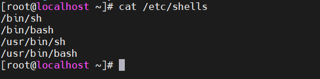
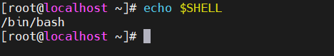
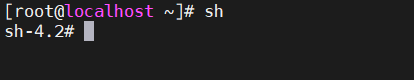
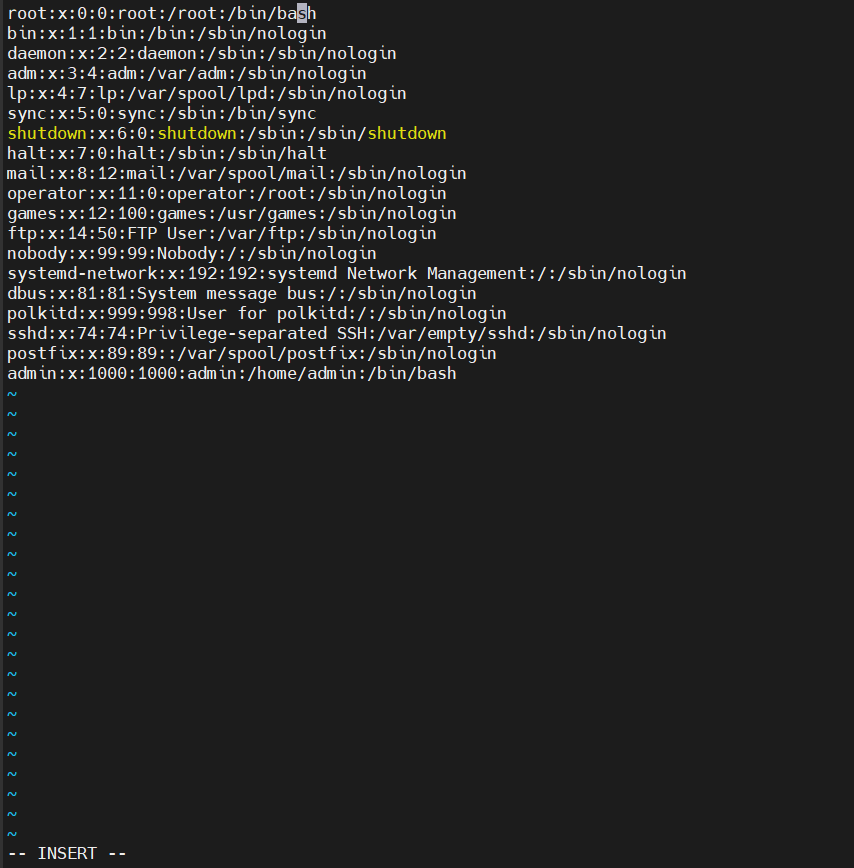
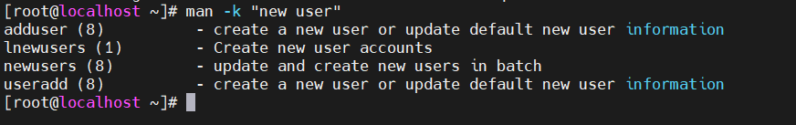
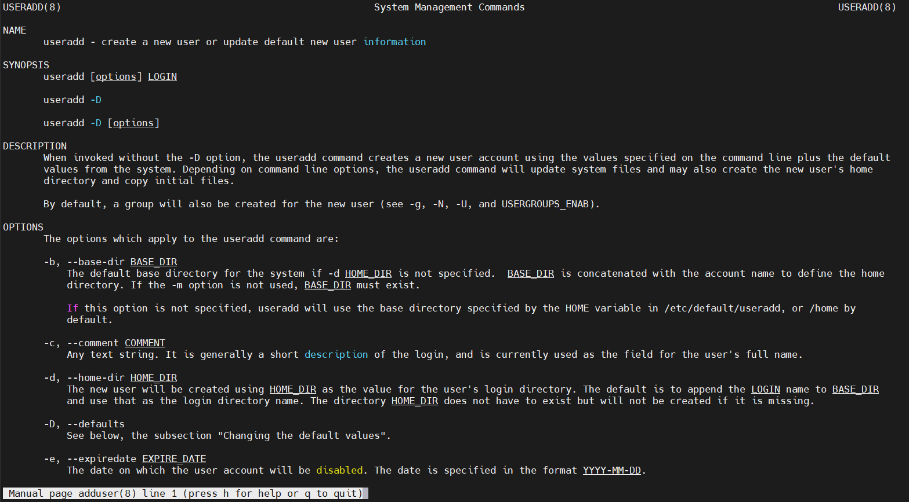

# Tổng quan về shell
Shell là một chương trình giao diện người dùng (CLI) cung cấp cho người dùng quyền truy cập vào hệ điều hành Linux. Nó hoạt động như một trình thông dịch, thực thi các lệnh được nhập bởi người dùng hoặc được viết trong các tập lệnh shell. Shell cũng cung cấp một môi trường để thực thi các chương trình và quản lý các tệp và thư mục.

Ta sẽ dùng câu lệnh sau để biết trên hệ điều hành của mình đang có sẵn các shell nào 

```
cat /etc/shells
```


Ngoài các shell trên còn những shell khác như 
- /bin/csh
- /bin/tcsh

Với những shell sẵn có thì đâu là shell đang biên dịch lệnh mặc định của hệ điều hành , ta dùng lệnh dưới đây để biết shell nào đang hoạt động 

```
echo $SHELL
```


Để đổi sang shell khác để sử dụng hãy gõ tên shell muốn đổi sang 



Để thay đổi shell mặc định ta sửa file /etc/passwd 



Đối với các user có đường dẫn /nologin tương đương với việc không thao tác trên shell vì đó là dịch vụ cung cấp cho người dùng

# Thao tác nhiều lệnh cùng lúc 

- cmd1;cmd2 : chạy lần lượt từng lệnh 

- cmd1||cmd2 : chạy 2 khi 1 k chạy

- cmd1&&cmd2 : chạy 2 khi 1 chạy

Cách tra cứu câu lệnh với lệnh `man`

*Ví dụ*: Ta muốn tìm lệnh để tạo 1 user mới

```
man -k "new user"
```


Với những lựa chọn hệ điều hành trả về khi ta tra cứu câu lệnh , ta dùng lệnh `man` để xem hướng dẫn cách dùng câu lệnh 

```
man adduser
```


Câu lệnh trả về nội dung bao gồm 
- Cấu trúc câu lệnh 
- Mô tả câu lệnh 
- Các option đi kèm câu lệnh

*Luư ý khi không sử dụng được lệnh `man`*

update database khi không sử dụng được lệnh man 

- mandb

- mandb makewhatis


# Một số phím tắt khi dùng lệnh

ctrl -a : lên đầu dòng câu lệnh 
ctrl -e : xuống cuối dòng câu lệnh
esc-f : Tiến lên từng từ 
esc-b : Lùi về từng từ
ctrl -l : clear màn hình 
ctrl -c : dừng câu lệnh 


# Khai báo biến môi trường 

